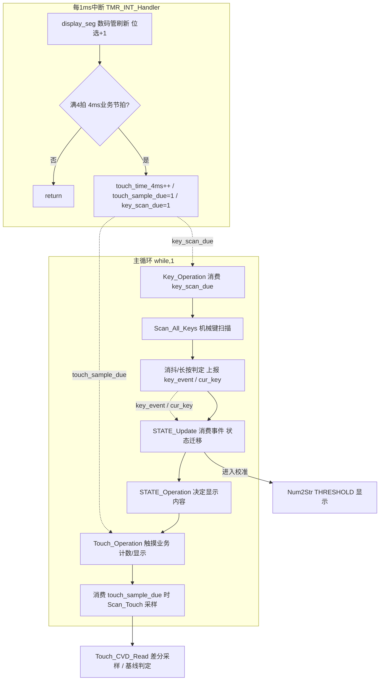
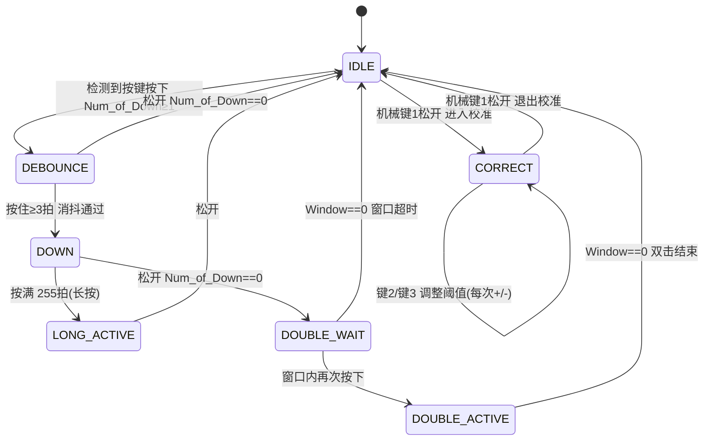
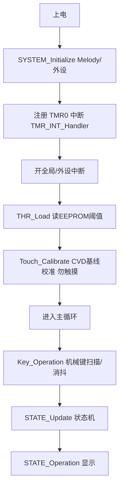

# 触摸-按键-数码管一体控制系统 实验汇报

> 平台：Microchip PIC16F18854　/　MPLAB X IDE + MCC　/　XC8 编译器
> 说明：本文档面向实验汇报与流程图绘制，包含系统架构、功能定义、核心算法与可复用的 Mermaid 流程图。

---

## 1. 项目概述

本项目基于 PIC16F18854 实现一个集 **机械矩阵按键、电容式（CVD）触摸按键、4 位数码管显示、阈值校准、EEPROM 手动保存** 于一体的控制板演示系统。

- **机械按键**（RC0~RC3）：10 键矩阵，用于功能切换（进入校准、调阈值、自动校准等）。
- **触摸按键**（RC4/RC5/RC6）：3 路电容式触摸，采用 ADC2 的 CVD（电容分压）差分测量，支持单点轻触计数、双击、长按。
- **数码管**：RB0~RB3 位选 + LATA 段码，1 ms 中断逐位扫描刷新（4 ms 一轮，约 250 Hz/位）。
- **EEPROM**：保存校准后的触摸阈值 `THRESHOLD`，支持上电加载。

---

## 2. 硬件资源分配

| 功能 | 引脚 | 说明 |
|---|---|---|
| 机械键盘（4 地键 + 6 交叉键） | RC0~RC3 | 输入，`Scan_All_Keys` 扫描 + `key()` 编码为 1~10 |
| 触摸 1 通道 | RC4 | ADC2 通道 0x14，CVD 差分测量 |
| 触摸 2 通道 | RC5 | ADC2 通道 0x15，CVD 差分测量 |
| 触摸 3 通道 | RC6 | ADC2 通道 0x16，CVD 差分测量 |
| 数码管位选 | RB0~RB3 | 哪一位被点亮 |
| 数码管段码 | 端口 A（LATA） | `seg_table[p[i]]` 段驱动 |
| 数据 EEPROM | 片内 | 256 B，存阈值（低/高/校验） |

> 触摸通道号约定：RC4=0x14、RC5=0x15、RC6=0x16（勿用 0x0F/RB7）。

---

## 3. 软件结构

```
main.c
 ├─ main()          初始化 → 上电读阈值 THR_Load → 触摸基线校准 Touch_Calibrate → 主循环
 │                    主循环：STATE_Update() + STATE_Operation()
 ├─ TMR_INT_Handler  1ms 中断：数码管刷新 + 4ms 业务节拍（机械键扫描/消抖/长按、触摸采样标志）
 ├─ STATE_Update     状态迁移 + 消费按键事件（切校准/调阈值/自动校准）
 ├─ STATE_Operation  按当前状态决定显示缓冲区 p[] 内容
 └─ Touch_Operation  触摸键业务：消抖、单击/双击/长按、计数显示
Key_Scan.c           机械键扫描 Scan_All_Keys + 编码 key()
Touch_Read.c         触摸 CVD 采样、基线校准、阈值计算、触控通道判定
Seg_driver.c         数码管 print_seg / display_seg / Num2Str
nvm 模块(MCC)        EEPROM_Read / EEPROM_Write / NVM_UnlockKeySet / NVM_IsBusy
```

---

## 4. 功能与原理解释

### 4.1 机械矩阵按键（RC0~RC3）→ 10 键
- `Scan_All_Keys()`：`TRISC` 配输入，`level` 从 `0x0F` 逐级 /2（0x0F→0x07→0x03→0x01）改变扫描深度，读 `PORTC&level`。
- 用 `number_of_zero = (Key_Value^level) & ((Key_Value^level)-1)` 判定"这一级是否恰好只有 1 个低电平"，从而定位单个按键。
- `key(level, Key_Value)`：把"扫描级 + 读值"换算成键号 `c*(c-1)/2 + 1 + i`（1~10）；`level==0` 时返回 0。

### 4.2 触摸按键 CVD 原理（ADC2 双采样差分）
- 用 ADC2 的**采样保持电容作为固定参考电容**，与触摸电极自电容（Cp+Cfinger）构成分压器。
- `Touch_CVD_Read()`：`ADPCH` 选通道 → `ADCONT=0` 下**连续两次软件触发**（`ADGO=1` + 等 `GO_nDONE`），硬件完成正/负极性双采样，差值写入 **ADERR**，返回 `(int16_t)ADERR`（差分结果，抗共模/抗电源波动）。
- `Touch_CVD_Read_Avg()`：8 次平均降噪。
- `Touch_Calibrate()`：逐通道丢弃前 4 轮后用 8×8 次平均建立基线 `touch_base[]`（上电时请勿触摸）。

### 4.3 触摸判定（`Scan_Touch`）
- 对 3 通道各取均值，与基线算非负差 `abs_diff`（不确定触摸使读数升/降）。
- `delta > THRESHOLD` 判触摸；取最大差值通道为当前触摸通道（0/1/2），无触摸返回 `0xFF`。
- `delta < THRESHOLD/4+1` 时做慢漂移补偿（EMA α=1/32）跟踪基线。

### 4.4 触摸业务（`Touch_Operation`）
- **消抖**：同一通道连续采样一致（`candidate_count>=3`）才进入稳定，否则视为抖动。
- **单击**：稳定按下 → 松开且无长按时，先进入 `pending` 等待双击窗口（128×4ms≈0.5s），窗口内无第二击才 +1 计数，显示 `D`。
- **双击**：同一键在等待窗口内再次按下 → 计数 +5 并显示 `S`。
- **长按**：按住满 0.5s 后每 0.5s +1，显示 `L`。
- **显示**：`p[] = [键号, 类型字母, 计数十位, 计数个位]`；未触摸待机显示 `0D00`。

### 4.5 机械键功能（状态机）

| 按键 | 空闲态作用 | 校准态作用 |
|---|---|---|
| 键 1 | 进入校准态 | 退出校准态 |
| 键 2 | —— | 阈值 +1（短按）或长按节拍 +1 |
| 键 3 | —— | 阈值 -1（短按）或长按节拍 -1 |
| 键 4 | 自动校准（手指按住触摸键再按 4） | —— |
| 键 5 | 清空三个触摸键计数 | 清空三个触摸键计数 |
| 键 6 | —— | 手动保存阈值到 EEPROM（闪烁 2 次提示） |

### 4.6 状态机
用 `current_state / next_state` 双变量，`STATE_Update` 先 `current_state=next_state` 再迁移。

```
STATE_IDLE
STATE_CORRECT       校准态：常显 THRESHOLD
STATE_DEBOUNCE      机械键消抖等待
STATE_DOWN          按住计数（长按/松开判定）
STATE_LONG_ACTIVE   长按已生效
STATE_DOUBLE_WAIT   双击窗口等待
STATE_DOUBLE_ACTIVE 双击生效
```

### 4.7 阈值手动保存（EEPROM）
- 地址：`0x00`=阈值低字节，`0x01`=高字节，`0x02`=校验值 `0xA5`。
- `THR_Load()`：上电校验通过才用 EEPROM 值覆盖 `THRESHOLD`。
- `THR_Save()`：先 `NVM_UnlockKeySet(UNLOCK_KEY)` 再写 3 字节，等 `NVM_IsBusy()` 完成。
- **手动保护机制**：平时阈值只存 RAM，不自动落盘；校准态下按机械键 **6** 手动触发一次 `THR_Save()` 写入 EEPROM，并以两次全灭闪烁提示保存成功。只按需手动写，避免校准过程反复写磨损 EEPROM（寿命约 10 万次）。
- 上电由 `THR_Load()` 自动读回上次手动保存的阈值并生效。
- **当前状态**：手动保存已实现（键 6）；无掉电自动检测（未做供电电压监测，掉电瞬间不自动保存）。

---

## 5. 主程序数据流



---

## 6. 系统状态转换图



> 说明：机械键的消抖/长按/双击判定主要由中断 + 状态机（DEBOUNCE/DOWN/DOUBLE_*）承担；触摸键的单双击消抖在 `Touch_Operation` 内独立完成（连续采样 + 等待窗口）。

---

## 7. 触摸按键判定流程图

```mermaid
flowchart TD
    S([每4ms 触摸采样]) --> A[ch = Scan_Touch]
    A --> B{与上一候选一致?}
    B --否--> C[candidate=ch, 计数=1]
    B --是--> C2[计数++]
    C2 --> D{计数≥3?}
    D --否--> E[视为抖动, 不动作]
    D --是--> F{稳定键变化?}
    F --新键按下--> G{双击窗口内同键再按?}
    G --是--> H[计为第二击 +5 显示S]
    G --否--> I{上一个待定单击?}
    I --是--> J[确认上一单击 +1]
    I --否--> K[记为新待定单击]
    F --松键--> L{长按中?}
    L --否--> M[进入单击等待窗口]
    L --是--> N[长按计数并按0.5s节拍+1 显示L]
    J --> O[更新显示 p[]]
    H --> O
    M --> O
    N --> O
```

---

## 8. 上电流程



---

## 9. 实验操作步骤

1. 上电（请勿触摸触摸键），数码管应显示待机 `0D00`。
2. 触摸任一触摸键 → 对应键点亮并计数一次（`D`）或长按重复（`L`）。
3. 快速双击同一触摸键 → 计数 +5（`S`）。
4. 按机械键 4（手指按住某触摸键）→ 自动计算阈值并进入校准态，显示当前阈值。
5. 校准态下按机械键 2/3 → 阈值 ±1（长按可连调），键 1 退出校准。
6. 校准态下按机械键 6 → 阈值手动写入 EEPROM（闪烁 2 次提示），重启由 `THR_Load` 自动读出恢复。

---

## 10. 遗留/待办

- [ ] 机械键单击/双击事件尚不完整（`KEY_SINGLE/KEY_DOUBLE_*` 已定义未使用），DEBOUNCE/DOWN 状态机与中断派发存在双轨，需统一。
- [ ] CVD 采样参数（预充电/采保时间、平均次数）与阈值方向需按实际板级再微调。